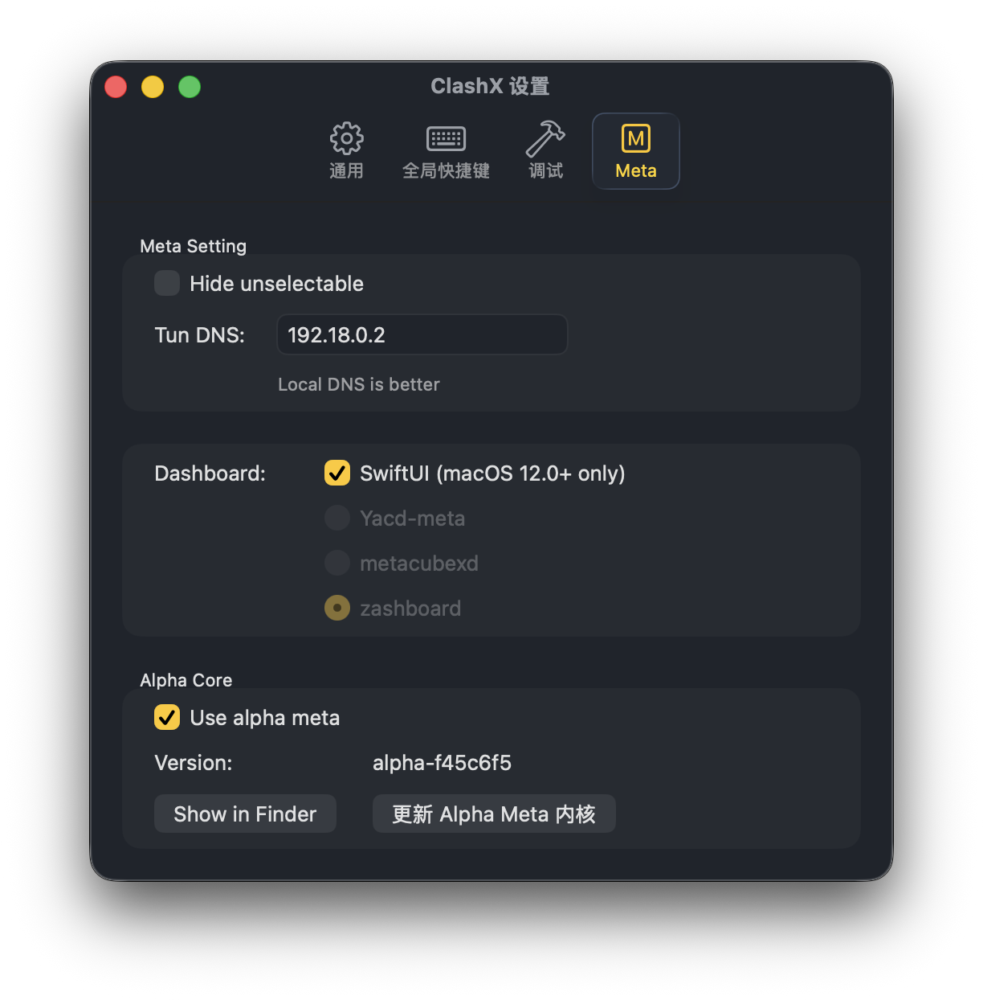

# Clash Config Script

## 🎯 TODO

- [ ] 1. 迁移到 GEOSITE
- [ ] 2. 避免使用 classic behavior 规则
- [ ] 3. 检查 https://github.com/DustinWin/ShellCrash/blob/dev/public/fake_ip_filter.list 以补全 fake-ip-filter
- [ ] 5. 使用 token 和 kv 优化
- [ ] 6. subrequest 被 cloudflare 缓存

## 🖥️ 使用方法

- 获取机场订阅地址，进行 base64 转码
- 添加机场订阅 URL: https://clash.jctaoo.site/sub?sub=your-base64-url
- 可以为订阅设置自动更新，1440分钟更新一次
- clash-verge-rev: 打开 虚拟网卡模式，关闭系统代理，虚拟网卡配置中，开启 严格路由
- clashx.meta: 根据如下图片配置，然后使用 tun 模式，关闭系统代理 
  > https://github.com/MetaCubeX/ClashX.Meta/issues/103#issuecomment-2510050389
- 其他 clash: 使用 tun 模式

## 📟 一键命令

### 🪟 PowerShell

```ps1
$RawUrl = "https://your-raw-url";
$SubUrl = [Convert]::ToBase64String([Text.Encoding]::UTF8.GetBytes($RawUrl));
$ConfigUrl = "https://clash.jctaoo.site/sub?sub=$SubUrl";
$EncodedConfigUrl = [System.Net.WebUtility]::UrlEncode($ConfigUrl)
$UrlScheme = "clash://install-config?url=$EncodedConfigUrl";
Start-Process $UrlScheme
```

### 🧑‍💻 MacOS

```sh
RAW_URL="https://your-raw-url"
SUB_URL=$(echo -n $RAW_URL | base64)
CONFIG_URL="https://clash.jctaoo.site/sub?sub=$SUB_URL"
ENCODED_CONFIG_URL=$(python3 -c "import urllib.parse; print(urllib.parse.quote('''$CONFIG_URL'''))")
URL_SCHEME="clash://install-config?url=$ENCODED_CONFIG_URL"
open $URL_SCHEME
```

### 📱 iOS

获取并运行 [快捷指令](https://www.icloud.com/shortcuts/e3afa7a85e924aa3926e6ea6b686bc83) (mac 也可以用)